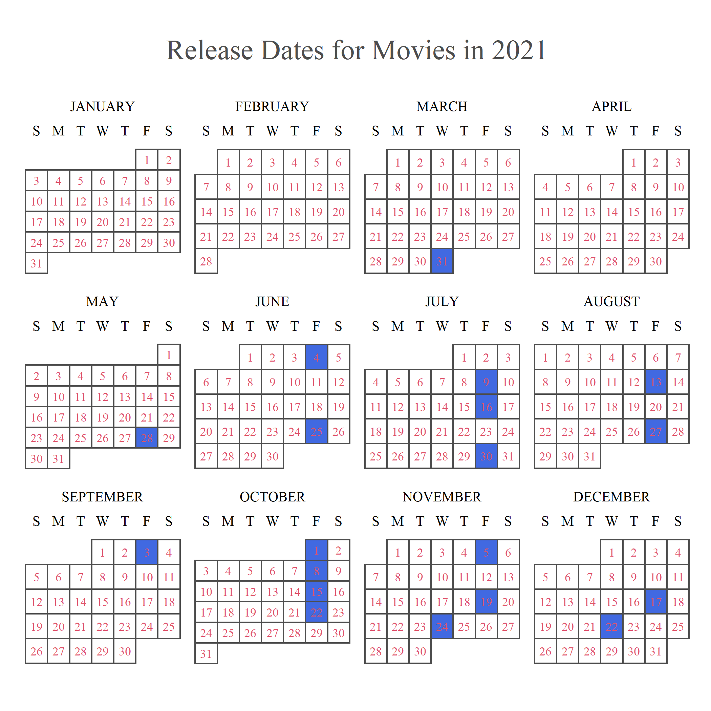

```{r setup, include=FALSE}
library(rvest)
library(tidyverse)
library(janitor)
library(readr)
library(dplyr)
library(gt)
library(scales)
library(ggthemes)
library(extrafont)
library(knitr)
loadfonts(device = "win")
knitr::opts_chunk$set(echo = FALSE)
```

```{r clean up movies url, echo = FALSE}
movies_url1 <- "https://www.boxofficemojo.com/year/2021/?grossesOption=totalGrosses&sort=rank&sortDir=asc&ref_=bo_yld__resort#table" #has list of movies from year of 2021
movies_2021 <- read_html(movies_url1) |> 
  html_element("body#body") |>
  html_table() |> 
  clean_names() |> 
  select(-c(genre, budget, running_time)) |>
  mutate(across(.cols = everything(), na_if, "-")) |> 
  mutate(gross = parse_number(gross),
         max_th = parse_number(max_th),
         opening = parse_number(opening),
         percent_of_total = parse_number(percent_of_total), # Needs to be a percentage.
         open_th = parse_number(open_th),
         estimated = parse_logical(estimated))
```

```{r clean up genre url, echo = FALSE}
genre_url1 <- "https://www.the-numbers.com/market/2021/genres"
genre_2021 <- read_html(genre_url1) |> 
  html_table()

genre_2021_clean <- genre_2021[[2]] |> 
  clean_names() |> 
  mutate(x2021_gross = parse_number(x2021_gross),
         tickets = parse_number(tickets),
         share = parse_number(share)) # This is in percentage
```

## Introduction

This is a project on the analyses of Movies in 2021. I wanted to look at what made movies this year so special. After everything that has gone through in our lives in the past year, movies were a great way to relax and start enjoying ourselves. 2021 was a special year for movies, especially because this was when theaters began to open back up, and people wanted to get out of the house and start watching movies with popcorn in their hands. I thought it would be interesting to see what movies compelled people to come out and see cinematic pieces on the big screen.

## Background

The COVID-19 virus hit the population hard. It quarantined us for about one and a half years. People stayed at home watching movies on streaming services. Once August of 2021 hit, things started going slowly back to normal. Movies played a massive part in bringing people out of their homes and wanting to go to the theaters. It would be nice to see what made these movies successful.

## Factors

In 2021 especially, I believe that there are factors that have made some certain movies do really well in the past year. I think that these factors are might have a contribution in what made these movies successful.

1. The Distribution Company: I think this may be because of marketing and how well they could sell their movies to the public to come out of their comfort zone and watch during such trying times.

2. Genre: I think the genre of a film can entice an audience to watch a movie. If there is a big following for a type of movie, then people will come and watch it.

3. Release Date: In 2021, this one factor maybe very important. Because COVID was still a great issue at the beginning of 2021, people were not as likely to go out and watch a movie.

4. Confounding things that I found while determining if a movie is successful or not.

## Data
I found data about each movie's gross dollar amount, release date, and other details about movies in 2021. I thought this data set would be interesting to look at to dissect which movies were the greatest films of this year. I also found another data set about the genre of movies that came out in 2021. This was a little less detailed, and there were data sets in data sets, so I chose the most basic one to display my point.

## TOP 10

```{r top ten movies of 2021 table, echo = FALSE}
movies_2021 |> # TOP 10 MOVIES FOR 2021 TABLE
  select(rank, release, gross, open, distributor) |>
  slice(1:10) |> 
  gt() |> 
  tab_header(title = md("**Top 10 Movies of 2021**")) |> 
  cols_label(rank = "Rank",
             release = "Title",
             gross = "Gross Dollar Amount",
             open = "Release Date",
             distributor = "Distribution Company") |> 
  tab_source_note(md("Source: *IMDb.com and Box Office Mojo*"))
```

This table shows the top 10 highest-grossing movies in the year 2021. 

A few things to note:
- No Way Home made about 4 times more than Shang-Chi

- All of these movies were made in the latter half of 2021

- The Distribution companies are well-known companies

- Movies 1, 2, 3, 4, and 6 are part of the Marvel Cinematic Universe or somehow associated with Marvel.

- Although not listed here, Movies 1 to 6 and 8 are listed as Action.

```{r openings for top 10 2021 films, echo = FALSE, fig.width= 10, fig.height= 5}
movies_2021 |> #What movies had the best opening?
  select(release, percent_of_total) |> 
  slice(1:10) |> 
  arrange(desc(percent_of_total)) |> 
  ggplot(movies_2021, mapping = aes(x = release, y = percent_of_total, fill = release)) +
  geom_col() +
  scale_y_continuous(n.breaks = 6, 
                     limits = c(0,50), 
                     labels = unit_format(unit = "%")) +
  scale_x_discrete(expand = expansion(), labels = NULL) + 
  theme_economist() +
  labs(title = md("The Percentage of the Gross Dollar Amount\nthe Top 10 movies of 2021 made on\nOpening Weekend"),
       x = "Movie Title",
       y = "Opening Percent of Total",
       caption = "Source: IMDb.com and Box Office Mojo",
       fill = "Movie Title") +
  theme(text = element_text(family = "serif"),
        axis.title.x = element_text(size = 15),
        axis.title.y = element_text(size = 15),
        axis.text.y = element_text(size = 15),
        legend.text = element_text(size = 8),
        axis.line.x = element_blank(),
        axis.ticks.x = element_blank(),
        plot.title = element_text(hjust = .5))
```

I added this graph as food for thought. It shows the percent of the total gross amount earned on opening day. The graph that has the lowest percentage means that it had more money made in subsequent weeks. I thought this was interesting and added it in just so it is here.

## Factor 1: Distribution Company

```{r table for count of distributors who made the top 10 films, echo = FALSE}
movies_2021 |> #TABLE FOR AMOUNT OF FILMS MADE BY EACH DISTRIBUTION COMPANY
  clean_names() |> 
  select(distributor, gross) |> 
  slice(1:10) |> 
  group_by(distributor) |> 
  summarize(count_per_distri = n()) |> 
  gt() |> 
  tab_header(title = md("**Number of Movies the Top 10 Movies\' Distribution Companies Made that ended up in the Top 10 of 2021**")) |> 
  cols_label(distributor = md("**Distribution Company**"),
             count_per_distri = md("**Count**")) |> 
  tab_source_note(md("Source: *IMDb.com and Box Office Mojo*"))
```

This is the table with all of the distribution companies in the Top 10 Movies for 2021, and the number of movies they made in the top 10.

```{r money made by top 10 distributors in 2021, echo = FALSE, fig.width= 10, fig.height= 5}
movies_2021 |> # THIS IS THE GRAPH OF MONEY MADE BY DISTRIBUTION COMPANY
  select(distributor, gross) |> 
  group_by(distributor) |> 
  summarize(total_gross_per_distri = sum(gross)) |> #Inaccurate because Foreign films are combined into an Na category
  arrange(desc(total_gross_per_distri)) |> 
  slice(1:10) |> 
  ggplot(movies_2021, 
         mapping = aes(x = distributor, 
                       y = total_gross_per_distri, 
                       fill = distributor)) +
  geom_col() +
  scale_y_continuous(n.breaks = 14, 
                     limits = c(0,1300000000), 
                     labels = unit_format(prefix = "$", 
                                          unit = "B", 
                                          scale = 1e-9)) +
  scale_x_discrete(expand = expansion(), labels = NULL) + 
  theme_economist() +
  labs(title = md("The Gross Dollar Amount the Top 10\nDistribution Companies made in films in 2021"),
       x = "Distribution Company",
       y = "Gross Dollar Amount",
       caption = "Source: IMDb.com and Box Office Mojo",
       fill = "Distribution Company") +
  theme(text = element_text(family = "serif"),
        axis.title.x = element_text(size = 15),
        axis.title.y = element_text(size = 15),
        axis.text.y = element_text(size = 15),
        legend.text = element_text(size = 8),
        axis.line.x = element_blank(),
        axis.ticks.x = element_blank(),
        plot.title = element_text(hjust = .5))
```

This is a graph of the gross amount of money that the top 10 distribution companies made.

**Analysis:**

In 2021, Sony was the Distributor that made the most money-making movies. They made 3 movies this year that ended up in the top 10, and they made the highest gross amount. Does this mean that if someone wants a successful movie, they should go with Sony? No, that is causation. Is there a correlation? Not really. They had a really good year with one of the biggest films of the year. Spider-Man was heavily anticipated, bringing people out to the theaters in crowds. Strategically it was also released at the end of the year, meaning it was when people were more comfortable going to the theaters. So does the distributor have an impact on if the movie will be successful? I don't think so.

**Issues**
Spider-Man was a very anticipated movie. People watched it over and over again, and people talked about for a long time after it released. It was a reunion and nostalgic film- a great success for Sony. Sony doesn't have this type of success every year which makes this somewhat biased. That is not to say that Sony isn't a good distributor, but this was an outlier.

## Factor 2: Genre

```{r table of number of each genre released, echo = FALSE}
genre_2021_clean |> 
  select(rank, genre, movies) |> 
  gt() |> 
  tab_header(title = md("**Number of Movies in 2021 According to Genre**")) |> 
  cols_label(rank = "Rank",
             genre = "Genre",
             movies = "Count") |> 
  tab_source_note(md("Source: *Nash Information Services*"))
```

This table shows how many movies in 2021 were made according to the genre. There were a lot of action movies that were made in 2021.

```{r money per genre in 2021, echo = FALSE, fig.width= 10, fig.height= 5}
genre_2021_clean |> #Gross Dollar Amount 
  select(genre, x2021_gross) |> 
  ggplot(genre_2021_clean, 
         mapping = aes(x = genre,
                       y = x2021_gross,
                       fill= genre)) +
  geom_col() +
  scale_y_continuous(n.breaks = 12, 
                     limits = c(0,2400000000), 
                     labels = unit_format(prefix = "$", 
                                          unit = "B", 
                                          scale = 1e-9))+
  scale_x_discrete(expand = expansion(), labels = NULL) +
  theme_economist() +
  labs(title = md("Gross Dollar Amount of each type of Genre in 2021"),
       x = "Genre",
       y = "Gross Dollar Amount",
       caption = "Source: Nash Information Services",
       fill = "Genre") +
  theme(text = element_text(family = "serif"),
        axis.title.x = element_text(size = 15),
        axis.title.y = element_text(size = 15),
        axis.text.y = element_text(size = 15),
        legend.text = element_text(size = 10),
        axis.line.x = element_blank(),
        axis.ticks.x = element_blank(),
        plot.title = element_text(hjust = .5))
```

This is a graph about the gross amount of money each genre made. This graph shows the action genre made. Clearly, it shows that action movies were very desirable in 2021 beacause it made the most money.

**Analysis**

As we said earlier, 7 of the 10 movies in the top 10 were Action movies. There were a lot of action movies this year compared to other genres. This was a popular year for action movies. After a long year of COVID, people were primarily drawn to Action and Adventure. It looks like with the Top 10 Movies and with the most grossing genre, people like Action movies. Does that mean that Action movies are most likely to be successful? No, correlation doesn't equal causation. But it is possible.

Issues: More movies were Action, so there should be more money generated for the Action genre.

## Factor 3: Release Date

```{r}

```

**What can we take away from this?**

We can see the blue concentration at the year's end. This shows that to have a successful movie in 2021, it is best if it was released in the latter part of the year.

## Conclusion

Of all the factors I have listed, the most influential ones were the Release Dates and the Genre of the movies. They were significantly able to determine if a movie was able to be successful. Though Correlation doesn't equal Causation, it still can see if a movie is good or not. Sure factors such as plot and acting quality matter when coming to a good movie so we can't rely on these three factors.

## Issues

This was a really good year for Marvel Movies. They released 4 movies for their universe and had a Venom movie too. A successful franchise with many fans, theaters were packed for these movies. James Bond and the Fast and Furious Franchises also have grand followings, so these movies will be successful too. Factors like popularity also play a role, so we can't say that all Action movies will do good in this type of year. This is some food for thought for a COVID ridden year. 
Another thing was the No Way Home became very popular because of a leak. It showed that past Spider-Man actor Andrew Garfield was likely to be in the movie. This created lots of nostalgia for older audiences and made people come to the theaters to watch their favorite superheroes.
There are other factors that need to come into play such as the plot or the acting quality when it determining whether a movie was good or not too.